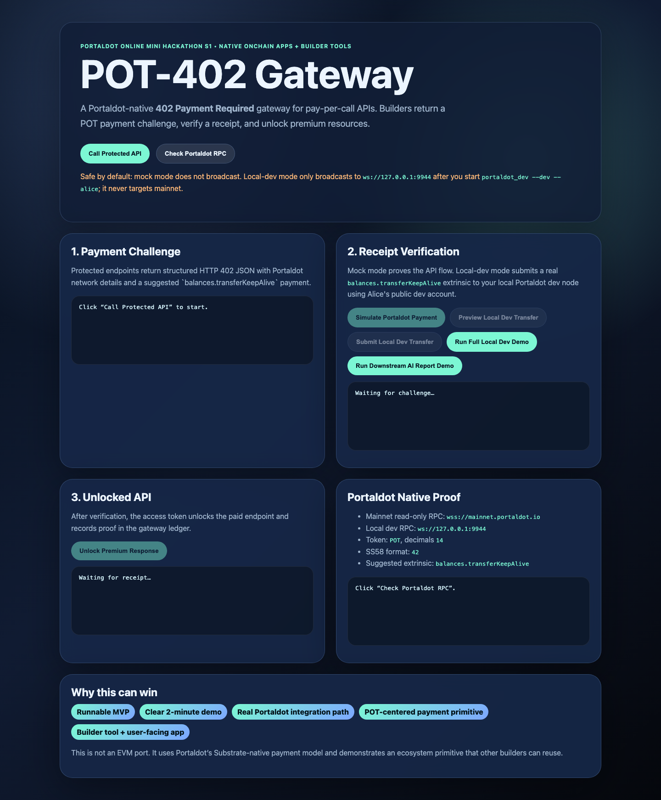
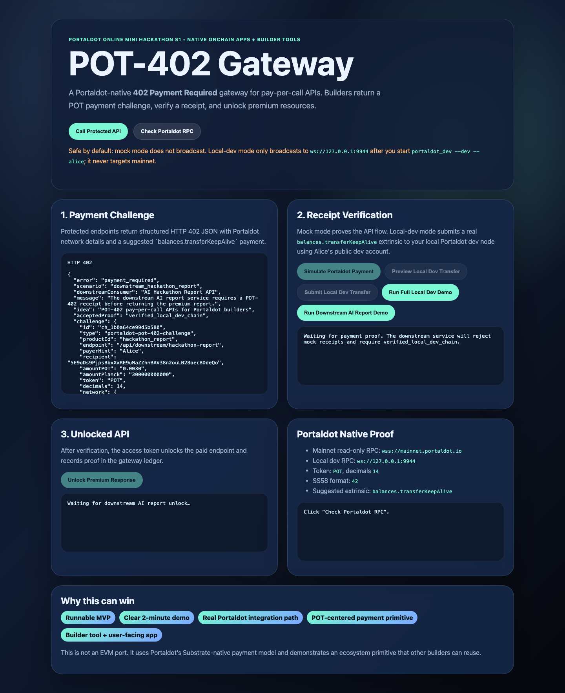
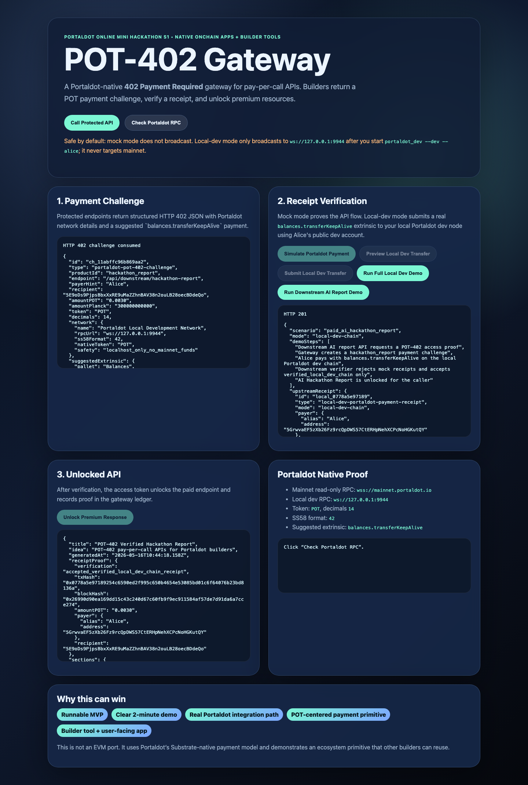
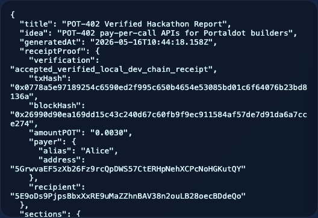
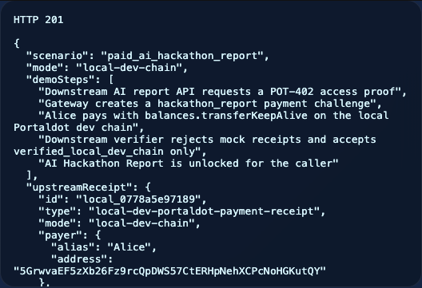

# POT-402 Gateway

Portaldot-native **HTTP 402 Payment Required** gateway for pay-per-call APIs.

Built for **Portaldot Online Mini Hackathon S1** targeting the 3,500 USDT prize pool.

## Why this exists

Portaldot builders need a simple primitive for monetizing APIs, data feeds, tools, creator resources, and builder services using native POT payments.

POT-402 Gateway demonstrates a small but reusable pattern:

1. A protected or downstream API returns `402 Payment Required`.
2. The response includes a Portaldot/POT payment challenge.
3. The user pays POT on a local Portaldot dev node or, in safe mock mode, simulates a receipt.
4. The gateway verifies the receipt and unlocks the API response.
5. A downstream service can independently require `verified_local_dev_chain` before returning premium content, proving the gateway is reusable beyond the built-in demo.

## Hackathon fit

| Criteria | How this project addresses it |
|---|---|
| Portaldot Native Deployment | Uses Portaldot chain config, POT decimals, and native `balances.transferKeepAlive` as the payment proof primitive. |
| Demo Completion | Runnable local web app and API with a clear 402 → payment → unlock flow. |
| Application Value | Gives Portaldot builders a reusable API monetization primitive. |
| Presentation Quality | One-click protected API demo, receipt ledger, and concise proof story. |

## Portaldot facts used

- Mainnet read-only RPC: `wss://mainnet.portaldot.io`
- Local dev RPC: `ws://127.0.0.1:9944` after running `portaldot_dev --dev --alice`
- SS58 format: `42`
- Token: `POT`
- Decimals: `14`
- Native payment primitive: `balances.transferKeepAlive(dest, value)`

Sources:

- https://dorahacks.io/hackathon/portaldot-online-s1/tracks
- https://portaldot-dev.readthedocs.io/en/latest/chain-info.html
- https://portaldot-dev.readthedocs.io/en/latest/module-interface/extrinsics/balances.html

## Safety boundary

This MVP is **safe by default**:

- Mock mode does **not** request private keys.
- Mock mode does **not** broadcast Portaldot transactions.
- Mock mode does **not** claim mock receipts are real on-chain transactions.
- Local-dev mode only submits transactions to `ws://127.0.0.1:9944`, and only with well-known public Substrate development accounts such as `//Alice`.
- Local-dev mode refuses public RPC endpoints, so it cannot accidentally target mainnet.

Public testnet/mainnet mode should replace local-dev payment with an approved Polkadot.js / Portaldot wallet transaction using `balances.transferKeepAlive`. Any public-chain transaction, public deployment, or final submission requires explicit user confirmation.

## Run locally

```bash
npm install
npm test
npm run smoke
npm start
```

For local-dev mode after the node is running:

```bash
npm run dev:local
npm run smoke:local-dev
npm run smoke:downstream
```

Open:

```text
http://localhost:4020
```

## Recommended judge demo: downstream AI report

The strongest demo path is the downstream `AI Hackathon Report API`. It proves that POT-402 Gateway is not just unlocking its own placeholder endpoint; a separate downstream consumer can require a real local-chain POT receipt before returning premium content.

### What the judge sees

1. The downstream API is called without payment and returns `HTTP 402 Payment Required`.
2. The 402 response includes a `hackathon_report` payment challenge with a native `balances.transferKeepAlive(dest, value)` payment instruction.
3. Alice pays `0.0030 POT` on the local Portaldot dev chain through `ws://127.0.0.1:9944`.
4. The gateway stores a `verified_local_dev_chain` receipt with tx hash, block hash, payer, recipient, amount, and fee.
5. The downstream verifier rejects mock receipts and accepts only `verified_local_dev_chain` receipts.
6. The downstream service returns `POT-402 Verified Hackathon Report`.

### Run the recommended demo

Terminal 1 — start Portaldot local dev node:

```bash
# from the downloaded portaldot-testnet-macos or portaldot-testnet-ubuntu directory
./portaldot_dev --dev --alice --tmp
```

Terminal 2 — start the gateway in local-dev mode:

```bash
npm install
npm run dev:local
```

Open the UI:

```text
http://localhost:4020
```

Click:

```text
Run Downstream AI Report Demo
```

Expected proof labels:

```text
scenario: paid_ai_hackathon_report
mode: local-dev-chain
verification: verified_local_dev_chain
downstreamVerification: accepted_verified_local_dev_chain_receipt
unlockedReport: POT-402 Verified Hackathon Report
```

CLI equivalent:

```bash
curl -s -X POST http://localhost:4020/api/demo/downstream/hackathon-report/local-dev \
  -H 'content-type: application/json' \
  -d '{"idea":"POT-402 pay-per-call APIs for Portaldot builders","payer":"Alice"}'
```

### Capture presentation screenshots

The repository includes a repeatable screenshot capture script for hackathon submissions. It drives the running local UI/API with Playwright, performs the downstream local-dev demo, and saves image assets under `docs/assets/screenshots/`.

First-time setup:

```bash
npm run screenshots:install
```

Capture screenshots:

```bash
npm run screenshots
```

Generated assets:

| Step | Screenshot | What it shows |
|---|---|---|
| 1 | [`01-home.png`](docs/assets/screenshots/01-home.png) | Landing page and available demo actions |
| 2 | [`02-downstream-402-challenge.png`](docs/assets/screenshots/02-downstream-402-challenge.png) | Downstream API returning `HTTP 402` before payment |
| 3 | [`03-local-dev-receipt-proof.png`](docs/assets/screenshots/03-local-dev-receipt-proof.png) | Local Portaldot receipt and downstream verification proof |
| 4 | [`04-unlocked-ai-report.png`](docs/assets/screenshots/04-unlocked-ai-report.png) | The unlocked AI hackathon report |
| 5 | [`05-receipt-panel-closeup.png`](docs/assets/screenshots/05-receipt-panel-closeup.png) | Close-up of tx hash, block hash, payer, amount, and verification status |

### Screenshot gallery











## Local dev chain demo

The judge demo uses the official Portaldot local development network:

```bash
# from the downloaded portaldot-testnet-macos or portaldot-testnet-ubuntu directory
./portaldot_dev --dev --alice
```

Then keep the node running and start the gateway:

```bash
POT402_MODE=local-dev POT402_LOCAL_RPC=ws://127.0.0.1:9944 npm start
```

Local-dev flow:

**One-click demo path:**

1. Click **Run Full Local Dev Demo**.
2. Show the generated 402 challenge, localhost-only transfer preview, verified local receipt, and unlocked premium API payload.

**Downstream verification demo path:**

1. Click **Run Downstream AI Report Demo**.
2. Show the downstream `AI Hackathon Report API` returning a POT-402 challenge before payment.
3. Show Alice paying `0.0030 POT` on the local Portaldot dev chain through `balances.transferKeepAlive`.
4. Show the downstream verifier accepting only `verified_local_dev_chain` receipts and rejecting mock receipts.
5. Show the unlocked `POT-402 Verified Hackathon Report`.

**Step-by-step demo path:**

1. Click **Call Protected API**.
2. Click **Preview Local Dev Transfer** to show the exact `balances.transferKeepAlive(dest, value)` call.
3. Click **Submit Local Dev Transfer** to send a real transfer from `//Alice` to the gateway recipient on `ws://127.0.0.1:9944`.
4. Click **Unlock Premium Response**.
5. Show the receipt ledger with local tx hash, block hash, events, amount, payer, recipient, and access token redaction.

This proves real Substrate/Portaldot transaction mechanics without mainnet funds.

## Demo flow

### Mock flow

1. Click **Call Protected API**.
2. Observe `HTTP 402` with a Portaldot/POT payment challenge.
3. Click **Simulate Portaldot Payment**.
4. Observe a deterministic mock tx hash and access token.
5. Click **Unlock Premium Response**.
6. Observe the paid API response and receipt proof.
7. Click **Check Portaldot RPC** for a read-only chain status check.

## API routes

| Route | Method | Purpose |
|---|---|---|
| `/api/health` | GET | Health check |
| `/api/chain/config` | GET | Portaldot chain config and docs links |
| `/api/chain/status` | GET | Read-only RPC status; never broadcasts tx |
| `/api/products` | GET | Demo paid API products |
| `/api/protected/weather` | GET | Protected API, returns 402 until access token is provided. Local demo supports `?accessToken=...`; public deployments should prefer an Authorization Bearer header to avoid logging tokens in URLs. |
| `/api/protected/builder_alpha` | GET | Second protected product |
| `/api/downstream/hackathon-report` | POST | Real downstream scenario: AI report API returns 402 until a verified local-dev receipt is provided |
| `/api/receipts/simulate` | POST | Create safe mock receipt for a challenge |
| `/api/receipts/local-dev/preview` | POST | Preview localhost-only `balances.transferKeepAlive` payment for a challenge |
| `/api/receipts/local-dev` | POST | Submit localhost-only local dev transfer and create verified local receipt |
| `/api/demo/local-dev` | POST | Run the full one-click local dev challenge → transfer → unlock demo |
| `/api/demo/downstream/hackathon-report/local-dev` | POST | One-click downstream AI report demo: pay with local POT, verify receipt, unlock report |
| `/api/ledger` | GET | Local receipt/access ledger |

## Architecture

See [`docs/architecture.md`](docs/architecture.md).

## Demo script

See [`docs/demo-script.md`](docs/demo-script.md).

## Submission checklist

See [`docs/submission-checklist.md`](docs/submission-checklist.md).

## Submission assets

- [DoraHacks submission draft](docs/dorahacks-submission-draft.md)
- [Pitch copy](docs/pitch.md)
- [Judge Q&A](docs/judge-qa.md)
- [Technical proof notes](docs/technical-proof.md)
- [Architecture diagram HTML](docs/pot-402-architecture.html)

## Future real-mode path

- Add Polkadot.js extension wallet connect.
- Prepare `balances.transferKeepAlive(dest, value)` with challenge amount.
- Submit only after user approval and wallet confirmation.
- Verify tx hash by indexing the inclusion block or querying events.
- Store real receipt alongside mock/local receipts.

## License

MIT
