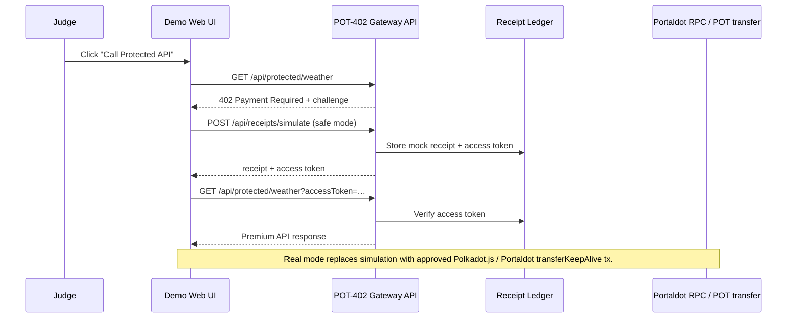

# POT-402 Gateway Architecture

## Boundary

- Safe mode demonstrates the complete gateway state machine without chain broadcast.
- Read-only chain endpoints can inspect Portaldot RPC.
- Real payment mode requires explicit approval before any Portaldot transaction.
